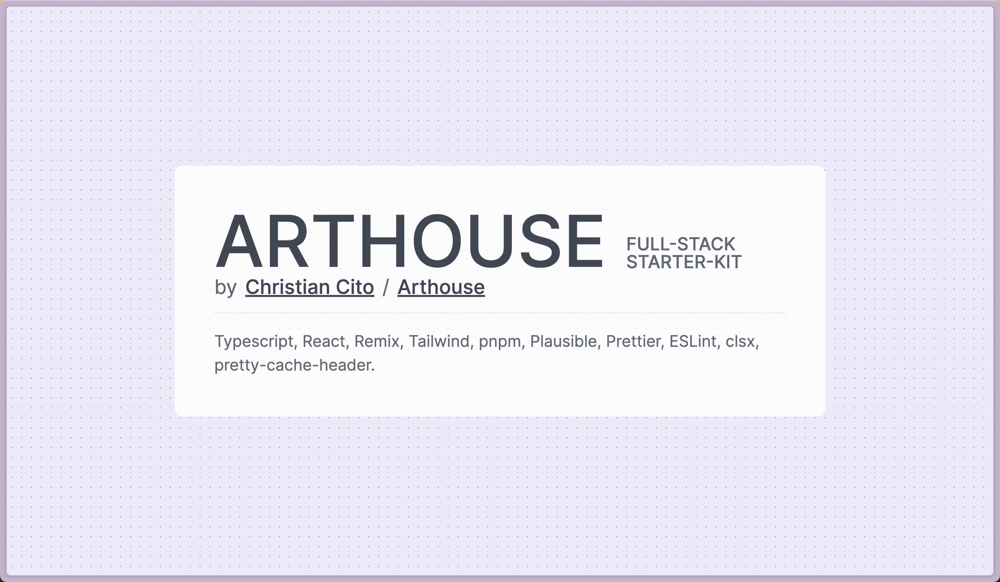

# Arthouse full-stack Sanity Starter Kit

Starter Kit for full-stack Typescript+React+Sanity web dev projects. Has sensible defaults, clears out boilerplate, setups up Sanity, and adds minimal utilities on top.

Includes a `.cursorrules` file to get you started with Cursor – adapt it to your needs/style.

Many parts are taken from [Simeon Griggs](https://github.com/SimeonGriggs)'s great [sanity-remix-template](https://github.com/SimeonGriggs/sanity-remix-template).

Made by [Christian Cito](https://chrcit.com?utm_source=arthouse-starter-kit&utm_medium=github) /
[Arthouse](https://madebyarthouse.com?utm_source=arthouse-starter-kit&utm_medium=github)

## Stack

- Sanity
- TypeScript
- React
- Remix w/ Vite
- Tailwind
- pnpm
- Plausible analytics
- Utilities (`prettier`, `eslint`, `clsx`, `pretty-cache-header`)

## Setup

Search for `change me` in the repo and replace with your own values.

See [docs/replicate.md](docs/replicate.md) for steps to replicate this setup.

## Pre-launch todos

- [ ] Submit /sitemap.xml to search console
- [ ] Setup domain in Plausible
- [ ] Configure [`app/config.ts`](./app/config.ts)
